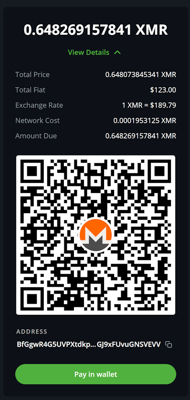

<div align="center">
  
  
  [](https://app.codacy.com/gh/btcpay-monero/btcpayserver-monero-plugin/dashboard?utm_source=gh&utm_medium=referral&utm_content=&utm_campaign=Badge_grade)
  [](https://app.codacy.com/gh/btcpay-monero/btcpayserver-monero-plugin/dashboard?utm_source=gh&utm_medium=referral&utm_content=&utm_campaign=Badge_coverage)
  [](https://matrix.to/#/#btcpay-monero:matrix.org)
</div>

# Monero BTCPay Server plugin

This plugin extends BTCPay Server to enable users to receive payments via Monero.

> [!WARNING]
> This plugin shares a single Monero wallet across all the stores in the BTCPay Server instance. Use this plugin only if you are not sharing your instance.

<p align="center">
  
</p>

## Configuration

Configure this plugin using the following environment variables:

| Environment variable | Description                                                                                                                                                                                                                                   | Example |
| --- |-----------------------------------------------------------------------------------------------------------------------------------------------------------------------------------------------------------------------------------------------| --- |
**BTCPAY_XMR_DAEMON_URI** | **Required**. The URI of the [monerod](https://github.com/monero-project/monero) RPC interface.                                                                                                                                               | http://127.0.0.1:18081 |
**BTCPAY_XMR_DAEMON_USERNAME** | **Optional**.  The username for authenticating with the daemon.                                                                                                                                                                               | john |
**BTCPAY_XMR_DAEMON_PASSWORD** | **Optional**. The password for authenticating with the daemon.                                                                                                                                                                                | secret |
**BTCPAY_XMR_WALLET_DAEMON_URI** | **Required**.  The URI of the [monero-wallet-rpc](https://getmonero.dev/interacting/monero-wallet-rpc.html) RPC interface.                                                                                                                    | http://127.0.0.1:18082 |
**BTCPAY_XMR_WALLET_DAEMON_WALLETDIR** | **Optional**. The directory where BTCPay Server saves wallet files uploaded via the UI ([See this blog post for more details](https://sethforprivacy.com/guides/accepting-monero-via-btcpay-server/#configure-the-bitcoin-wallet-of-choice)). | /home/cypherpunk/Monero/wallets/ |

BTCPay Server's Docker deployment simplifies the setup by automatically configuring these variables. For further details, refer to this [blog post](https://sethforprivacy.com/guides/accepting-monero-via-btcpay-server).

# For maintainers

## Building and testing

## Local Development Setup
If you're contributing to this plugin or running a local development instance of BTCPay Server with the Monero plugin, follow these steps.
## 1. Requirements

- .NET 8.0 SDK or later
- JetBrains Rider (recommended) or Visual Studio Code with C# support
- Git
- Docker and Docker Compose

## 2. Clone the Repositories
Create a working directory and clone both the BTCPay Server and Monero plugin repositories side by side:
If you are a developer maintaining this plugin, in order to maintain this plugin, you need to clone this repository with `--recurse-submodules`:

```bash
git clone https://github.com/btcpayserver/btcpayserver
git clone --recurse-submodules https://github.com/btcpay-monero/btcpayserver-monero-plugin
```
## 3. Build the Plugin
Navigate to the plugin directory and restore/build the solution:
```bash 
cd btcpayserver-monero-plugin
dotnet restore
dotnet build btcpay-monero-plugin.sln
```
To build and run unit tests, run the following commands:

```bash
dotnet build btcpay-monero-plugin.sln
dotnet test BTCPayServer.Plugins.UnitTests --verbosity normal
```
To run unit tests with coverage, install JetBrains dotCover CLI:

```bash
dotnet tool install --global JetBrains.dotCover.CommandLineTools
```
Then run the following command:

```bash
dotCover cover-dotnet --TargetArguments="test BTCPayServer.Plugins.UnitTests --no-build" --ReportType=HTML --Output=coverage/dotCover.UnitTests.output.html --ReportType=detailedXML --Output=coverage/dotCover.UnitTests.output.xml --filters="-:Assembly=BTCPayServer.Plugins.UnitTests;-:Assembly=testhost;-:Assembly=BTCPayServer;-:Class=AspNetCoreGeneratedDocument.*"
```

To build and run integration tests, run the following commands:

```bash
dotnet build btcpay-monero-plugin.sln
docker compose -f BTCPayServer.Plugins.IntegrationTests/docker-compose.yml run tests
```

| Environment variable | Description                                                                                                                                                                                                                                   | Example |
| --- |-----------------------------------------------------------------------------------------------------------------------------------------------------------------------------------------------------------------------------------------------| --- |
**BTCPAY_XMR_CASHCOW_WALLET_DAEMON_URI** | **Optional**. | The URI of the [monero-wallet-rpc](https://getmonero.dev/interacting/monero-wallet-rpc.html) interface for the cashcow wallet. This is used to create a second wallet for testing purposes in regtest mode.

## Code formatting

We use the **unmodified** standardized `.editorconfig` from .NET SDK. Run `dotnet new editorconfig --force` to apply the latest version.

To enforce formatting for the whole project, run `dotnet format btcpay-monero-plugin.sln --exclude submodules/* --verbosity diagnostic`

To enforce custom analyzer configuration options, we do use global _AnalyzerConfig_ `.globalconfig` file.

## 4. Configure BTCPay Server to Load the Plugin

For vscode, open the `launch.json` file in the `.vscode` folder and set the `launchSettingsProfile` to `Altcoins-HTTPS`.

Then create the `appsettings.dev.json` file in `btcpayserver/BTCPayServer`, with the following content:

```json
{
  "DEBUG_PLUGINS": "..\\..\\Plugins\\Monero\\bin\\Debug\\net8.0\\BTCPayServer.Plugins.Monero.dll",
  "XMR_DAEMON_URI": "http://127.0.0.1:18081",
  "XMR_WALLET_DAEMON_URI": "http://127.0.0.1:18082",
  "XMR_CASHCOW_WALLET_DAEMON_URI": "http://127.0.0.1:18092"
}
```
This will ensure that BTCPay Server loads the plugin when it starts.

## 5. Start Development Environment

Then start the development dependencies via docker-compose:
```bash
cd BTCPayServer.Plugins.IntegrationTests/
docker-compose up -d dev
```

Finally, set up BTCPay Server as the startup project in [Rider](https://www.jetbrains.com/rider/) or Visual Studio.

If you want to reset the environment you can run:
```bash
docker-compose down -v
docker-compose up -d dev
```

Note: Running or compiling the BTCPay Server project will not automatically recompile the plugin project. Therefore, if you make any changes to the project, do not forget to build it before running BTCPay Server in debug mode.

We recommend using [Rider](https://www.jetbrains.com/rider/) for plugin development, as it supports hot reload with plugins. You can edit `.cshtml` files, save, and refresh the page to see the changes.

Visual Studio does not support this feature.

When debugging in regtest, BTCPay Server will automatically create an configure two wallets. (cashcow and merchant)
You can trigger payments or mine blocks on the invoice's checkout page.

## About docker-compose deployment

BTCPay Server maintains its own [deployment stack project](https://github.com/btcpayserver/btcpayserver-docker) to enable users to easily update or deploy additional infrastructure (such as nodes).

Monero nodes are defined in this [Docker Compose file](https://github.com/btcpayserver/btcpayserver-docker/blob/master/docker-compose-generator/docker-fragments/monero.yml).

The Monero images are also maintained in the [dockerfile-deps repository](https://github.com/btcpayserver/dockerfile-deps/tree/master/Monero). While using the `dockerfile-deps` for future versions of Monero Dockerfiles is optional, maintaining [the Docker Compose Fragment](https://github.com/btcpayserver/btcpayserver-docker/blob/master/docker-compose-generator/docker-fragments/monero.yml) is necessary.


Users can install Monero by configuring the `BTCPAYGEN_CRYPTOX` environment variables.

For example, after ensuring `BTCPAYGEN_CRYPTO2` is not already assigned to another cryptocurrency:
```bash
BTCPAYGEN_CRYPTO2="xmr"
. btcpay-setup.sh -i
```

This will automatically configure Monero in their deployment stack. Users can then run `btcpay-update.sh` to pull updates for the infrastructure.

Note: Adding Monero to the infrastructure is not recommended for non-advanced users. If the server specifications are insufficient, it may become unresponsive.

Lunanode, a VPS provider, offers an [easy way to provision the infrastructure](https://docs.btcpayserver.org/Deployment/LunaNode/) for BTCPay Server, then it installs the Docker Compose deployment on the provisioned VPS. The user can select Monero during provisioning, then the resulting VPS have a Monero deployed automatically, without the need for the user to use the command line. (But the user will still need to install this plugin manually)

# Licence

[MIT](LICENSE.md)
